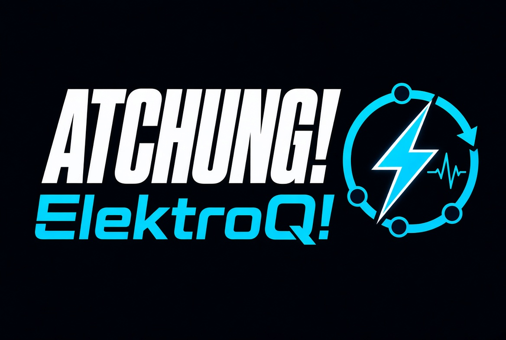

<p align="center">
  
</p>

# Atchung: ElectroQ!

**Attention! Something happened — here, or across the wire.**

Two complementary messaging layers for the JVM and GraalVM native-image, under one roof:

- **Atchung!** (`atchung-core`) — a realtime, multithreaded **in-VM broadcast/subscribe event bus**.
  Publish an event on a topic; every subscriber reacts. Zero-copy, zero-dependency, no reflection.
- **elektro-Q** (`elektroq/`) — a reflection-free **message-passing stack** that moves typed messages
  **between processes and across the network**. Codecs are generated at compile time from annotated
  records, so the whole stack compiles to a native binary with zero reachability configuration.
- **The bridge** (`atchung-elektroq`) — glue that lets a local `Topic` cross the wire. Author your
  events once as `@Message` records; the bus fans them out in-process and elektro-Q carries them out.

The design principle across both: **the fast in-VM path never pays for the network.** Cross-process
delivery is opt-in and lives entirely in elektro-Q and the bridge — the bus core stays pure.

## Modules

| Module | What it provides |
|---|---|
| `atchung-core` | The event bus: `Topic`, `Atchung`, inline/async/pumped delivery, `Backpressure`, pause/resume, and the `State<T>` synchronization primitive. Pure Java, no dependencies. |
| `atchung-probe` | The stack-wide profiling seam: `Probe`, `Lane`, spans, counters and a resource ledger. Off unless asked, free when off, and dependency-free so any layer can take it without taking the bus. See [`docs/probe.md`](docs/probe.md). |
| `atchung-elektroq` | `ElektroBridge` — wires an `Atchung` bus to an elektro-Q `Conduit`, both directions, with loop prevention. |
| `elektroq/` | The cross-process stack (own aggregator; coordinates `sibarum.elektro.queue:*`). See [`elektroq/README.md`](elektroq/README.md) for the full tutorial. Modules: `elektroq-core`, `elektroq-codegen`, `elektroq-transport-tcp`, `elektroq-transport-local`, `elektroq-netcode`, `elektroq-example`. |

## Which layer do I want?

- **One process, many components** (input, graphics, GUI, workers meeting on a bus) → **Atchung!**.
  See the model, delivery modes, and `State<T>` below.
- **Two processes or two machines** exchanging typed messages, with request/reply and schema
  versioning → **elektro-Q** directly ([`elektroq/README.md`](elektroq/README.md)).
- **A local bus whose selected topics should also reach a remote peer** → keep publishing on the bus
  and add an **`ElektroBridge`**.

## Atchung! in one screen

```java
Atchung bus = Atchung.create();                 // or Atchung.global()
Topic<InputEvent> INPUT = Topic.of("input", InputEvent.class);

bus.subscribe(INPUT, e -> ...);                  // inline — publisher's thread, lowest latency
bus.subscribeAsync(INPUT, e -> ..., workerPool); // async — your executor
Pump ui = bus.pump();                            // pumped — drain on YOUR thread, once per frame
ui.subscribe(INPUT, e -> ..., 256, Backpressure.DROP_OLDEST);

bus.publish(INPUT, event);                       // non-blocking; fans out to all three
ui.drain();                                      // deliver queued events on the render thread
```

Publishing never blocks (save a `BLOCK` mailbox); a full pumped mailbox is resolved by
`Backpressure` (`DROP_OLDEST`, `DROP_NEWEST`, `COALESCE_LATEST`, `BLOCK`). Any `Subscription` can
`pause()`/`resume()` (lossy — events during a pause are dropped, not buffered).

**Events vs. state.** Events answer *"what happened."* `State<T>` answers *"what is true now"* — one
producer commits declared mutations, consumers read coherent immutable versions (lock-free), react
per version, or block until a newer one exists, with bounded history. The version number and named
commit commands are the replication hooks the bridge builds on.

## Crossing the wire with the bridge

Declare the event as an elektro-Q `@Message` record (the codec is generated), then bridge its topic:

```java
Conduit conduit = ElektroTcp.client("client", "127.0.0.1", 7000, registry);
conduit.start().toCompletableFuture().join();

Topic<Move> MOVE = Topic.of("move", Move.class);   // Move is an @Message record

ElektroBridge bridge = new ElektroBridge(bus, conduit)
        .bridge(MOVE, MoveCodec.TYPE);              // both directions

bus.publish(MOVE, new Move(dx, dy));               // fans out locally AND goes over the wire
```

`bridge(...)` wires both directions; `outbound(...)`/`inbound(...)` pick one. Re-published inbound
messages are not echoed back to the wire, and a bridge does not relay between peers — a message from
one peer is delivered locally, not fanned back to the others.

## Requirements

- **JDK 25+** (enforced by `maven-enforcer-plugin`). A **GraalVM** JDK only for native builds.
- **Maven 3.9+**.
- `atchung-core` has no runtime dependencies and is native-image clean; elektro-Q adds no runtime
  dependencies either (its codec generator is compile-time only).

## Build

```bash
mvn verify     # compile + all tests across every module
mvn install    # + install 1.0-SNAPSHOT into your local repo
```

elektro-Q also ships a `native` profile for its self-verifying binary — see
[`elektroq/README.md`](elektroq/README.md).
